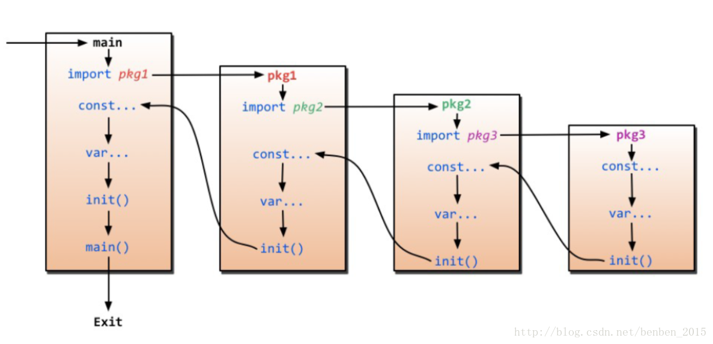

# Golang Note

[关于 golang 的初始化过程](https://blog.csdn.net/benben_2015/article/details/79486077)

[go 语言中省略号的用法](https://blog.csdn.net/qq_31930499/article/details/98353008)：

- 在数组字面量中，表示数组而非 slice：`arr := [...]int{1,2,3}`
- 打散 slice，将 slice 转换为一个个的元素。可能的使用环境：
  - slice 拼接：`dest = append(dest, src...)`
  - slice 中的深复制：go 中的切片是指针赋值，进行深复制的情况要特别注意
    - `ret = append(ret, append([]int(nil), cur...))`
    - 区别 `ret = append(ret, cur)`
- 变长函数参数：相当于传递数组的语法糖

[go 中 slice 的复制机制](https://studygolang.com/articles/19913?fr=sidebar)
