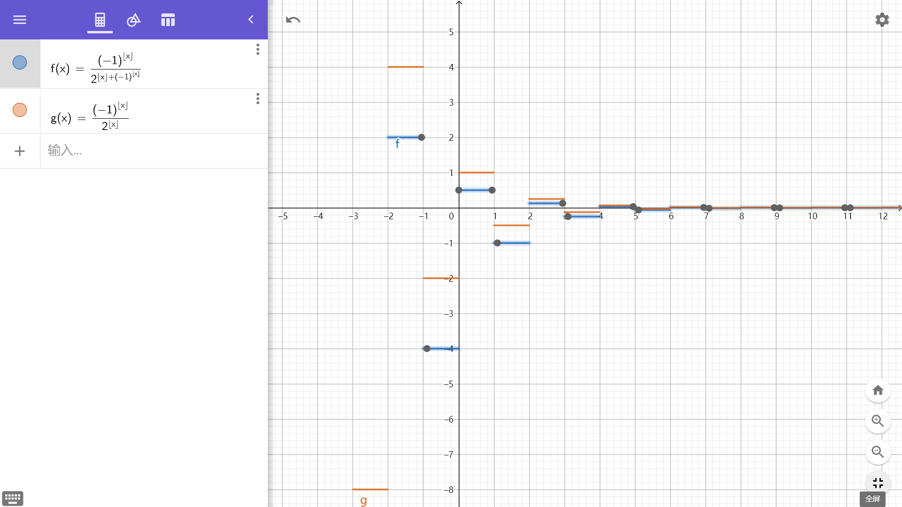

<!-- omit in toc -->
# 级数

## 1. 常数项级数

常数项级数：常数数列相加。主要考点：常数项级数的敛散性

级数收敛定义：部分和极限存在（部分和存在上界）

- 极限不存在的情况
  - 极限不存在的情况：$\infty$
  - 函数值反复横跳

使用定义证明敛散性，求出部分和的极限：

- 裂项、求和公式（等差等比数列）
- 定积分近似、定积分放缩、夹逼定理

利用级数性质：

- 级数乘常数敛散性不变
- 收敛级数相加减，级数收敛
  - 收敛级数和发散级数相加减，级数发散
  - 发散级数相加减，级数敛散性不确定
- 改变级数的有限项不影响级数的敛散性
  - 去除不符合条件的级数项（莱布尼兹准则）
- 增加括号后可能改变级数的敛散性：得到的级数可能由发散变为收敛
  - 若级数项同号，增加括号不影响部分和
  - 若级数项异号，不同项之间可能相互抵消

级数收敛的必要条件：$\sum\limits_{n\to\infty}u_n = 0$

分成三种情况进行讨论：

- 正项级数
- 交错级数
- 任意项级数

### 1.1. 正项级数

本质上：判断同号的级数项

基本定理证明：证明部分和有上界（无上界）

- 比较判别法：对级数进行放缩
  - 级数收敛，放大级数的项
  - 级数发散，缩小级数的项
- 比较法的极限形式：$\lim\limits_{n\to\infty}\frac{u_n}{v_n} = l$
  - 比值为常数，敛散性相同，$u_n$ 可以和它的**等价小量**进行比较
    - e.g. $\sum\left[(1 + \frac{1}{n^2})^2 - 1\right] \to \sum\frac{2}{n^2}$
  - 比值为无穷小量，$\{u_n\}$ 比 $\{v_n\}$ 更容易收敛
    - 正项级数中，$\sum \sqrt[a]{u_n}$ 收敛，则 $\sum u_n$ 收敛
    - $u_n$ 是 $\sqrt[a]{u_n}$ 的高阶小量
    - 在交错级数中，$\sum |u_n|$ 收敛，则 $\sum u_n^{2}$ 收敛
    - 阶数比较法：$$
  - 比值为无穷大量，$\{u_n\}$ 比 $\{v_n\}$ 更容易发散
- 比值法：$\lim\limits_{n\to\infty}\frac{u_{n+1}}{u_n} = \rho$
- 根值法：$\lim\limits_{n\to\infty}\sqrt[n]{u_n} = \rho$

比较的基准级数：

- p 级数：$\sum\frac{1}{n^p}$ 等价于反常积分 $\int_a^\infty \frac{1}{x^p}\mathrm{d}x = \frac{1}{1-p}x^{1-p}|^\infty_a$
  - 对应等价小量 $\lim\limits_{x \to \infty}\frac{1}{x^p} = \lim\limits_{x \to 0}x^p$
- 等比级数：$\sum aq^n = a\frac{1 - q^n}{1 - q}$

### 1.2. 交错级数

交错级数：一正一负的级数，将正负交替的项转换为正数项进行讨论

- $\sum\left[(-1)^n u_n\right], \{u_n\} > 0$

莱布尼兹准则：$\{u_n\}$ 单调递减，$\lim\limits_{n\to\infty} = 0$；则交错级数收敛

- 莱布尼兹准则是级数收敛的充分条件
- 收敛的交错级数中 $\{u_n\}$ 可能不递减
- 满足莱布尼兹准则的数列，极限小于等于第一项，可以用于估计余项的误差

一个重要的级数：
  
- $\sum\frac{1}{\log^a n}$ 发散，$\lim\limits_{n\to\infty}\log^a n \ll \lim\limits_{n\to\infty}n^b (b = 1)$
- $\sum\left[(-1)^n\frac{1}{\log^a n}\right]$ 收敛
- 没说是正项级数的收敛级数不妨多考虑：$\sum\left[(-1)^n\frac{1}{\log^a n}\right]$

### 1.3. 任意项级数

引入绝对值，转换为正数项进行讨论

- 绝对收敛：$\sum|u_n|$ 收敛，则 $\sum u_n$ 收敛
- 条件收敛：$\sum u_n$ 收敛，$\sum|u_n|$ 发散（正负抵消）
  - 条件收敛的级数的正项（或负项）构成的级数发散
  - $\sum\frac{u_n \pm |u_n|}{2} = \sum\frac{u_n}{2} \pm \sum\frac{|u_n|}{2}$，前一个级数收敛，后一个级数发散

## 2. 幂级数

主要考题：

- 收敛半径、收敛区间（开区间）、收敛域（需要讨论区间端点）的求解
- 函数展开为幂级数
- 级数求和（重难点）

阿贝尔定理：

- $x = x_0$ 收敛，$|x| < |x_0|$ 幂级数绝对收敛
  - $x = x_0$ 条件收敛，$x_0$ 为收敛区间的一个端点
- $x = x_0$ 发散，$|x| > |x_0|$ 幂级数发散

幂级数的发散和收敛需要对不同的 $x$ 进行讨论。总共分为三种情况：

- $x \in R$ 均收敛、$x$ 在一个区间中收敛、$x$ 在一点收敛

收敛半径的求解：$R = \frac{1}{\rho}$

- 实质要回归到正项级数：$\rho x < 1$ 收敛
  - $x$ 可以有不同的变形，e.g. $x \to [a(x - x_0)]^b$
- $\lim\limits_{n \to \infty} |\frac{a_{n+1}}{a_n}| = \rho$
  - $\lim\limits_{n \to \infty}\frac{a_{n+1}x^{n+1}}{a_nx^n}  = \lim\limits_{n \to \infty} \frac{a_{n+1}}{a_n}x < 1$ 收敛
- $\lim\limits_{n \to \infty} |\sqrt[n]{|a_n|}| = \rho$
  - $\lim\limits_{n \to \infty} \sqrt[n]{a_nx^n} = \lim\limits_{n \to \infty} \sqrt[n]{a_n}x < 1$ 收敛

分析性质：可导、可积

- 由于幂级数可导，考虑将函数展开为幂级数，继而可以进行求导和不定积分
- 幂级数中 $n$ 和 $\frac{1}{n}$ 的因子不影响收敛半径

### 2.1. 函数展开为幂函数

讨论的问题：

- 能否展开：函数任意阶可导
- 展开的系数 $a_n = \frac{f^{(n)}(x_0)}{n!}(x - x_0)^n$

函数展开为幂级数的方法：

- 直接展开法：将 $f(x)$ 用泰勒级数进行展开，考察余项趋于 0
- **间接展开法**：通过已知函数的展开式求出函数的展开式（四则运算、微分、积分）
  - $f(x) = g[k(x-x_0)^\alpha] = \sum a_nk^n(x-x_0)^{\alpha n}$
  - 特别是复杂的函数展开为幂级数，可以考虑对函数进行求导或积分

将函数展开为幂函数需要特别注意讨论其收敛区间

常用展开式：

- $(1+x)^\alpha = \sum_{n=0}^\infty \frac{\prod_{i=1}^n (\alpha-n+i)}{n!}x^n$
- $\frac{1}{1-x} = \sum_{n=0}^\infty x^n = 1 + x + x^2 + \cdots$
- $e^x = \sum_{n=0}^\infty \frac{x^n}{n!} = 1 + x + \frac{x^2}{2!} + \cdots$

级数展开的一些妙用：

- 通过展开可以快速得到一些泰勒展开式的系数
  - e.g. $f(x) = \frac{1}{1+x^\alpha}, f^{(\beta)}(x) = (-1)^\beta x^{\alpha\beta}$

### 2.2. 级数求和

求和可以看作函数展开的逆过程，需要使用已有函数进行合并

- 逐项求积分消除分子系数：$\sum (n+\alpha)x^{n+\beta} = \frac{\alpha(1-x)+x}{(1-x)^2}x^\beta$
- 逐项求导消除分母系数：$\sum\frac{x^{n+\beta}}{n+\alpha} = x^{\beta - \alpha}\int\frac{x^\alpha}{1 - x}\mathrm{d}x$
  - $\sum\frac{x^n}{n} = -\ln(1-x)$
  - 注意这里 **$n$ 从 1 开始**
- 多个因子可以多次求导或求积分消去，分母中也可以使用裂项消去
  - e.g. $\frac{1}{(n - k_1)(n - k_2)} = \frac{1}{k_1 - k_2}(\frac{1}{n - k_1} - \frac{1}{n - k_2})$

## 3. 傅里叶级数

展开的要求：函数连续或只有有限个第一类间断点

- 区别幂级数的展开要求：函数任意阶可导

傅里叶系数：

- $a_n = \frac{1}{\pi}\int_{-\pi}^\pi f(x)\cos nx\mathrm{d}x$
- $b_n = \frac{1}{\pi}\int_{-\pi}^\pi f(x)\sin nx\mathrm{d}x$

傅里叶级数：$f(x) \sim \frac{a_0}{2} + \sum\limits_{n=1}(a_n\cos nx + b_n\sin nx)$

- 奇函数的展开：余弦分量 $\cos$ 为 0
- 偶函数的展开：正弦分量 $\sin$ 为 0

关于 $\cos n\pi - 1$ 的讨论：

- 分奇偶进行讨论
- 将 $\cos n\pi$ 转换为 $(-1)^n$ 进行讨论
