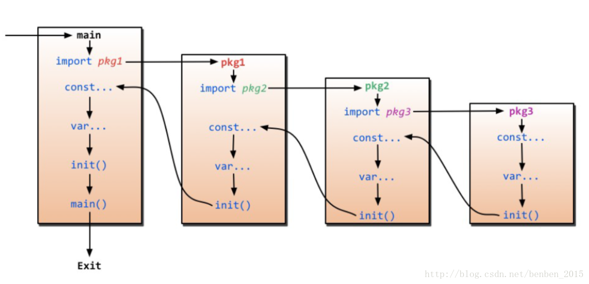

# Go Note

[关于 go 的初始化过程](https://blog.csdn.net/benben_2015/article/details/79486077)

[go 语言中省略号的用法](https://blog.csdn.net/qq_31930499/article/details/98353008)：

- 在数组字面量中，表示数组而非 slice：`arr := [...]int{1,2,3}`
- 打散 slice，将 slice 转换为一个个的元素。可能的使用环境：
  - slice 拼接：`dest = append(dest, src...)`
  - slice 中的深复制：go 中的切片是指针赋值，进行深复制的情况要特别注意
    - `ret = append(ret, append([]int(nil), cur...))`
    - 区别 `ret = append(ret, cur)`
- 变长函数参数：相当于传递数组的语法糖

[go 中 slice 的复制机制](https://studygolang.com/articles/19913?fr=sidebar)

go 中元素转为 []byte 的一些理解：

- [具体实现](https://cloud.tencent.com/developer/article/1067976)
- [低层原理](https://blog.csdn.net/weixin_39698255/article/details/111581070)

go 中的 `log` 标准库，只提供三种默认的 log 方式：

- `Fatal` 会保存日志并终止程序
- `Panic` 会保存日志并丢出异常终止程序
- `Print` 会保存日志但是程序继续
- 使用其它 log 方式可以自己构造 logger 或使用第三方库。一些链接：[logger](https://www.jianshu.com/p/73ae6dc4d16a)、[基本的 log](https://blog.csdn.net/fwhezfwhez/article/details/79203590)

使用 gdb 进行调试：

- 获得 go 运行时的相关支持，如：`goroutines` 等信息
  - 在 `.gdbinit` 中增加 `add-auto-load-safe-path /usr/local/go/src/runtime/runtime-gdb.py`
- 构建可执行文件使用：`go build -gcflags "-N -l" <src>` 关闭内联优化，方便调试
- 删除调试符号：`go build -ldflags "-s -w"`
- 对函数设置断点时，要加上包名如：`b main.main`
- 一些参考博客：[使用 gdb 对 go 进行调试](https://www.cnblogs.com/wongbingming/p/13063629.html)

[impl-func.go](./impl-func.go)
