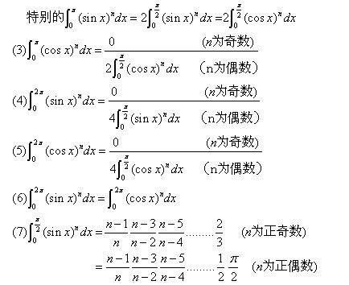

# 积分

## 不定积分

$\int f(x)\mathrm{d}x$，求一簇函数，存在和不存在的区别

- 求不定积分，需要**加上常数**：$F(x) + C$
- 同一个函数的原函数满足：$F_1(x) - F_2(x) = C$
- $f(x)$ 连续，则存在原函数
  - $f(x)$ 有第一类间断点，则没有原函数
  - $f(x)$ 只有第二类间断点，则有原函数

求不定积分的方法：

- 换元法：第一换元法、第二换元法（对被积函数中复杂的因子进行试探性积分）
- 分部积分：本质对不定积分中的因子进行**微分**
  - 对多项式因子微分，降次
  - 对 $\ln, \arcsin$ 等因子微分，去除因子
  - 对 $e^x, \sin$ 等因子微分，得到循环的积分
  - 积分中含有积分作为因子，微分去除积分算子

不定积分的一些小技巧：

- 分部积分快速展开：$u$ 求导，$v$ 积分，错位乘，正负交替
- 有理函数不定积分可以特值代入，求待定系数
  - 分母次数过高，可以进行倒数代换

不定积分的主要形式：

- $\int\sqrt{Ax^2 + bx + c}\mathrm{d}x$
  - $A>0$: $\int\sqrt{x^2 + a^2}\mathrm{d}x = a^2\int\sec^3\theta\mathrm{d}\theta$
    <!-- - $\frac{a^2}{4}\int(\frac{1}{1+\sin\theta} + \frac{1}{(1+\sin\theta)^2} + \frac{1}{1-\sin\theta} + \frac{1}{(1-\sin\theta)^2})\mathrm{d}\sin\theta$ -->
    - $\frac{a^2}{2}\ln(x + \sqrt{x^2 + a^2}) + \frac{x}{2}\sqrt{x^2 + a^2} + C$
  - $A>0$: $\int\sqrt{x^2 - a^2}\mathrm{d}x = a^2\int\sec\theta\tan^2\theta\mathrm{d}\theta$
    <!-- - $\frac{a^2}{4}\int(-\frac{1}{1+\sin\theta} + \frac{1}{(1+\sin\theta)^2} - \frac{1}{1-\sin\theta} + \frac{1}{(1-\sin\theta)^2})\mathrm{d}\sin\theta$ -->
    - $-\frac{a^2}{2}\ln(x + \sqrt{x^2 - a^2})+\frac{x}{2}\sqrt{x^2 - a^2} + C$
  - $A<0$: $\int\sqrt{a^2-x^2}\mathrm{d}x = a^2\int\cos^2\theta \mathrm{d}\theta$
    - $\frac{x}{2}\sqrt{a^2 - x^2} + \frac{a^2}{2}\arcsin\frac{x}{a} + C$

三角有理函数不定积分，常用变形：构造二次项、**半角公式/二倍角公式**、诱导公式、两角和差关系、1 的变换

## 定积分

$\int_a^b f(x)\mathrm{d}x$ 求极限，可积和不可积的区别

求定积分不一定需要求原函数

- 奇偶性（函数拆分、区间拆分）、周期性、几何意义

重要公式：

- $\int_0^\frac{\pi}{2}\sin^nx\mathrm{d}x = \int_0^{\frac{\pi}{2}}\cos^nx\mathrm{d}x$
  - $I_n = \frac{n-1}{n}I_{n-2}$
  - $I_n = \frac{n-1}{n}I_{n-2} -\frac{1}{n}\sin^{n-1}x\cos x|^b_a$
- $\int_0^\pi xf(\sin x)\mathrm{d}x = \frac{\pi}{2}\int_0^\pi f(\sin x)\mathrm{d}x$
- $\int_0^\pi f(\sin x)\mathrm{d}x = 2\int_0^{\frac{\pi}{2}}f(\sin x)\mathrm{d}x$

## 反常积分

收敛和不收敛的区别，计算反常积分需要特别注意**被积函数的定义域**

混合反常积分：瑕点积分、无穷限积分

- 可能需要分多个区间判断敛散性

比较判别法：利用参照对象判断函数的敛散性

- 不等式形式：非负函数 $f(x) \leq g(x)$，$\int g(x)$ 收敛 $\rArr \int f(x)$ 收敛
- 极限形式：非负函数 $\lim\frac{f(x)}{g(x)} = c$
  - 使用常用结论作比：$\lim x^pf(x) = c$
  - $0 < c < +\infty$, $c = 0$, $c = +\infty$
- 使用比较判别法，可以部分区间进行比较（处理混合反常积分）
