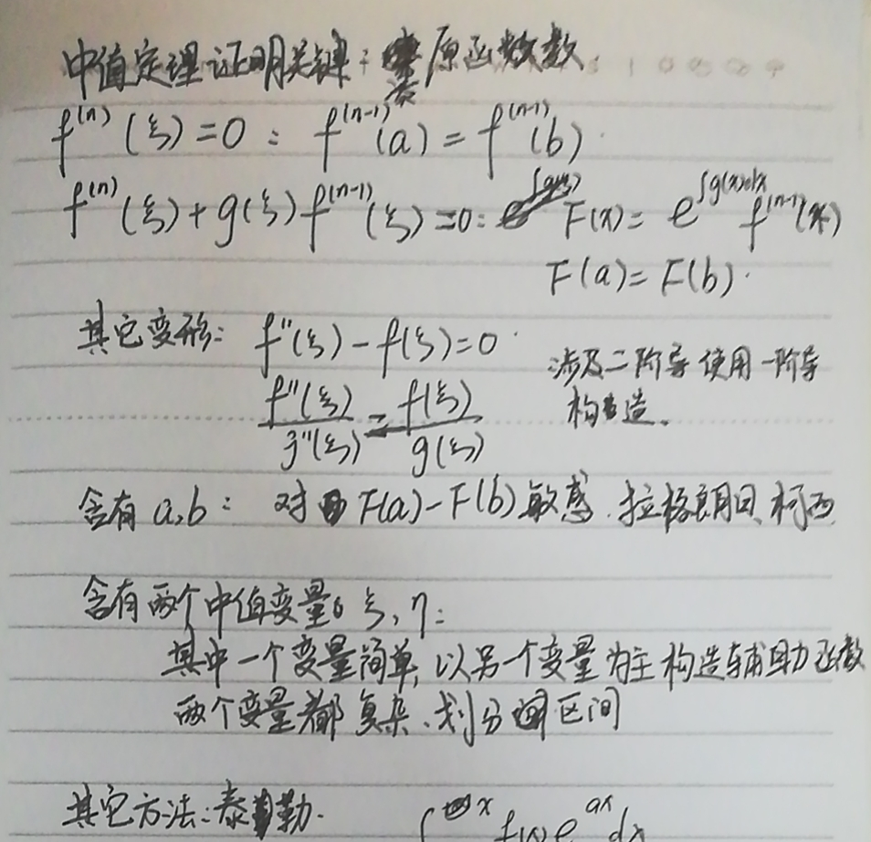

# 考前必记结论

等价无穷小：

- $\sin x = x - \frac{1}{6}x^3 + o(x^3)$
- $\arcsin x = x + \frac{1}{6}x^3 + o(x^3)$
- $\cos x = 1 - \frac{1}{2}x^3 + o(x^2)$
- $\tan x = x + \frac{1}{3}x^3  o(x^3)$
- $\arctan x = x - \frac{1}{3}x^3 + o(x^3)$

无穷大量之间的比较：$\ln^\alpha n \ll n^\beta \ll a^n \ll n! \ll n^n$

- $\lim\limits_{n\to\infty} \sqrt[n]{n} - 1 = \lim\limits_{n\to\infty} \frac{\ln n}{n}$
- 斯特林公式：$\lim\limits_{n\to\infty}\ln n! = \lim\limits_{n\to\infty} n \ln n - n$（）
  - $\lim\limits_{n\to\infty} a^ne^{n(\ln\frac{n}{a} - 1)} = \lim\limits_{n\to\infty} n!$

常用极限结论：

- $\lim\limits_{x\to0}\frac{\sin x}{x} = 1, \lim\limits_{x\to\infty}\sqrt[n]{f(n)} = 1(f(n) \ll a^n)$
- $\lim\limits_{x\to\infty}(1 + \frac{1}{x})^x = e$ 及其变形：
  - $\lim\limits_{x\to\infty}(1 - \frac{1}{x})^x = \frac{1}{e}$
  - $\lim\limits_{x\to0}\ln(1+x) = x$
  - $\lim\limits_{x\to0}\frac{a^x - 1}{x} = \ln a$
- $1^\infty$ 型：$\lim(1 + \alpha)^\beta = e^{\lim \alpha\beta}$

微分：

- $\frac{\mathrm{d}}{\mathrm{d}x}\frac{\beta}{\alpha^n} = \frac{\alpha\beta' - n\beta\alpha'}{\alpha^{n+1}}$
- $\frac{\mathrm{d}}{\mathrm{d}x}\ln(x + \sqrt{1 + x^2}) = \frac{1}{\sqrt{1 + x^2}}$
- $\frac{\mathrm{d}}{\mathrm{d}x}\tan x = \sec^2 x = \tan^2 x + 1 = \frac{1}{\cos^2 x}$
- $\frac{\mathrm{d}}{\mathrm{d}x}\cot x = -\csc^2 x = -(\cot^2 x + 1) = -\frac{1}{\sin^2 x}$
- $\frac{\mathrm{d}}{\mathrm{d}x}\arcsin x = \frac{1}{\sqrt{1 - x^2}}$
- $\frac{\mathrm{d}}{\mathrm{d}x}\arccos x = -\frac{1}{\sqrt{1 - x^2}}$
- $\frac{\mathrm{d}}{\mathrm{d}x}\arctan x = \frac{1}{1 + x^2}$
- $\frac{\mathrm{d}}{\mathrm{d}x}\arcctg x = -\frac{1}{1 + x^2}$
- $\frac{\mathrm{d}}{\mathrm{d}x}\sec x = \sec x \tan x = \frac{\sin x}{\cos^2 x}$
- $\frac{\mathrm{d}}{\mathrm{d}x}\csc x = -\csc x \cot x = -\frac{\cos x}{\sin^2 x}$

$\tan, \sec$ 与 $\cot, \csc$ 的关系：

- $\frac{\mathrm{d}}{\mathrm{d}x}\tan x = \sec^2 x$
- $\frac{\mathrm{d}}{\mathrm{d}x}\cot x = -\csc^2 x$
- $\frac{\mathrm{d}}{\mathrm{d}x}\sec x = \sec x \tan x$
- $\frac{\mathrm{d}}{\mathrm{d}x}\csc x = -\csc x \cot x$
- $\int \sec x \mathrm{d}x = \ln|\sec x + \tan x| + C$
- $\int \csc x \mathrm{d}x = -\ln|\csc x + \cot x| + C$
- $\int \tan x \mathrm{d}x = \ln|\sec x| + C$
- $\int \cot x \mathrm{d}x = -\ln|\csc x| + C$
- $\sec^2 x = \tan^2 x + 1$
- $\csc^2 x = \cot^2 x + 1$

一元函数相关概念：可微 $\lrArr$ 可导 $\rArr$ 连续 $\rArr$ 存在极限

- 数列（函数趋于无穷大）存在极限：
  - $\forall\epsilon > 0, \exist N < 0, \forall n > N, |x_n - a| < \epsilon$
- 函数趋于有限值存在极限：
  - $\forall\epsilon > 0, \exist\delta, \forall x, 0 < |x - x_0| < \delta, |f(x) - A| < \epsilon$
- 连续性：$\lim\limits_{x \to x_0} f(x) = f(x_0)$
- 间断点：$f(x)$ 在 $x_0$ 的去心邻域有定义，在 $x_0$ 不连续
  - 第一类间断点：左右极限存在
    - 可去间断点：左右极限存在且相等
    - 跳跃间断点：左右极限存在但不相等
  - 第二类间断点：左极限或右极限不存在
    - 无穷间断点：取极限的位置在无穷处
    - 震荡间断点：函数值进行无穷多次震荡，$x_0$ 处左右极限不存在
- 可导：$\lim\limits_{\Delta x\to0}\frac{f(x_0 + \Delta x) - f(x_0)}{\Delta x}$ 存在
  - 即左右连续（左右导数存在）且左右导数相等
  - 可导 $\rArr$ 连续，连续 $\nRightarrow$ 可导
  - 分段函数可导性，讨论间断点导数是否存在
- 可微：$\Delta y = \mathrm{d}y + o(\Delta x)$, $\mathrm{d}y = A \Delta x$
  - 可导 $\lrArr$ 可微
- 可积：定积分结果和区间划分和取点无关
  - 连续 $\rArr$ 可积，可积 $\nRightarrow$ 连续
  - 可积 $\rArr$ 变上限积分函数连续
  - 连续 $\rArr$ 变上限积分函数可导

多元函数相关概念：偏导数连续 $\rArr$ 可微 $\rArr$ 函数连续、偏导存在

- 连续性：$\lim\limits_{X \to X_0} f(X) = f(X_0)$
- 可导：偏导数 $\forall i, \frac{\partial z}{\partial x_i}$ 存在
  - 即 $\forall i, \lim\limits_{\Delta x_i \to 0} \frac{f(X_0 + \Delta x_i) - f(X_0)}{\Delta x_i}$ 存在
  - 分块函数可导性，讨论间断点导数是否存在
- 可微：$\Delta z = \mathrm{d}z + o(\rho)$，$\mathrm{d}z = \sum_i\frac{\partial z}{\partial x_i}\Delta x_i$
  - 即使用全微分近似表示函数改变量
  - $\lim\limits_{\rho \to 0}\frac{\Delta z - \mathrm{d}z}{\rho} = 0 \lrArr$ 可微
  - 可微 $\rArr$ 可导，偏导不存在 $\rArr$ 不可微
  - 偏导函数连续 $\rArr$ 可微

几个区间定理：

- 最值定理/有界性定理：连续函数闭区间 $[a, b]$ 有最值 / 有界
- 介质定理：连续函数闭区间 $[a, b]$
  - $\forall C\in[\min\{f(a),f(b)\}, \max\{f(a), f(b)\}], \exist\xi, f(\xi) = C$
- 均值定理：函数连续
  - $\exist\xi, f(\xi) = \frac{1}{n}\sum\limits_{i=1}^nf(x_i)$
- 费马定理：$x_0$ 为函数邻域的极值，则 $f'(x_0) = 0$
- 罗尔定理：函数连续可导
  - $f(a) = f(b) \rArr \exist\xi, f'(\xi) = 0$
- 拉格朗日中值定理：函数连续可导
  - $\exist\xi, \frac{f(b) - f(a)}{b - a} = f'(\xi)$
- 柯西中值定理：函数连续可导
  - $\exist\xi, \frac{f(b) - f(a)}{g(b) - g(a)} = \frac{f'(\xi)}{g'(\xi)}$
- 积分估值定理：
  - $\min f(x)(b - a) \leq \int_a^b f(x)\mathrm{d}x \leq \max f(x)(b - a)$
- 积分中值定理：
  - $\exist\xi,\int_a^bf(x)\mathrm{d}x = f(\xi)(b - a)$
  - 推广：$\exist\xi,\int_a^bf(x)g(x)\mathrm{d}x = f(\xi)\int_a^b g(x)\mathrm{d}x$

定理证明：

- 介质定理：零点存在定理
- 费马定理：夹逼定理
- 罗尔定理：最值定理、费马定理
- 拉格朗日中值定理：罗尔定理
- 柯西定理：拉格朗日定理
- 积分估值定理：最值定理
- 积分中值定理：最值定理、介质定理

常用辅助函数构造方法（中值定理的证明）：

- 通过题目给出的条件证明
- 通过题目证明的式子构造原函数
- 阶数差 1 的两个因子相乘：$[f(x)^2]' = 2f(x)f'(x)$
- 阶数差 2 的两项相加：$[f(x)^2 + f'(x)^2]' = 2f'(x)[f(x) + f''(x)]$
- 阶数差 1 的两项线性组合：$[f(x)e^{\varphi(x)}]' = [f'(x) + f(x)\varphi'(x)]e^{\varphi(x)}$
  - 令 $f'(x)$ 前面的因子为 1
<!-- - 阶数差 2 的两个因子相乘：$[f(x)f'(x)]' = f'(x)^2 + f(x)f''(x)$ -->

常用反常积分：

- $\int_0^{+\infty}e^{-x^2}\mathrm{d}x = \frac{\sqrt{\pi}}{2}$
- $\int_0^{+\infty}\frac{\sin x}{x}\mathrm{d}x = \int_0^{+\infty}\frac{\tan x}{x}\mathrm{d}x = \frac{\pi}{2}$
- $\int_a^{+\infty}\frac{1}{x^p}\mathrm{d}x = \frac{x^{1-p}}{1-p}|_a^{+\infty}$
  - $=\frac{1}{(p-1)a^{p-1}} (p > 1)$
- $\int_a^b\frac{1}{(x-a)^p}\mathrm{d}x = \frac{(x-a)^{1-p}}{1-p}|_a^b$
  - $=\frac{(b-a)^{1-p}}{1-p}(p < 1)$

常用的常数结论：

- $\frac{1}{1 + x} + \frac{1}{1 + x^{-1}} = 1$
  - sigmoid: $\frac{1}{1+e^x}$ 关于 $(0, \frac{1}{2})$ 对称
  - $\frac{1}{ae^x+1}$ 关于 $(-\ln a, \frac{1}{2})$ 对称
- $\arcsin x + \arccos x = \frac{\pi}{2}$
- $\arctan x + \arctan x^{-1} = \frac{\pi}{2}$
- $\arctan x + \arctan \frac{k+\tan x}{1-k\tan x} = \arctan k$
  - $\arctan x + \arctan \frac{1-x}{1+x} = \frac{\pi}{4}$

经典的一些困难定积分：

- $\int_0^1 \frac{\arctan x}{1+x}\mathrm{d}x$
- $\int_0^1\ln(1+\tan\theta)\mathrm{d}\theta$
- 区间再现的常用变换
  - $y - y_1 = \frac{(y_2-y_1) - \frac{y_2-y_1}{x_2-x_1}(x-x_1)}{1+(y_2-y_1)(x-x_1)}$
    - $x = x_1$ 时，$y = y_2$
    - $x = x_2$ 时，$y = y_1$
  - $y - a = \frac{(b-a)-(x-a)}{1 + (b-a)(x-a)}$
    - $x = a$ 时，$y = b$
    - $x = b$ 时，$y = a$

## 超级忘的结论

- 判断二元函数的极值
  - $f_{xx}''f_{yy}'' - (f_{xy}'')^2 > 0$ 是极值
  - $f_{xx}'', f_{yy}'' > 0$ 是极小值
  - $f_{xx}'', f_{yy}'' > 0$ 是极大值
- 隐函数二阶导
  - $\frac{\mathrm{d}^2y}{\mathrm{d}x^2} = -\frac{F_{xx}''F_y' - F_x'F_{xy}''}{(F_y')^2}$
  - 当 $\frac{\mathrm{d}y}{\mathrm{d}x} = - \frac{F_x'}{F_y'} = 0$ 时，$\frac{\mathrm{d}^2y}{\mathrm{d}x^2} = -\frac{F_{xx}''}{F_y'}$
